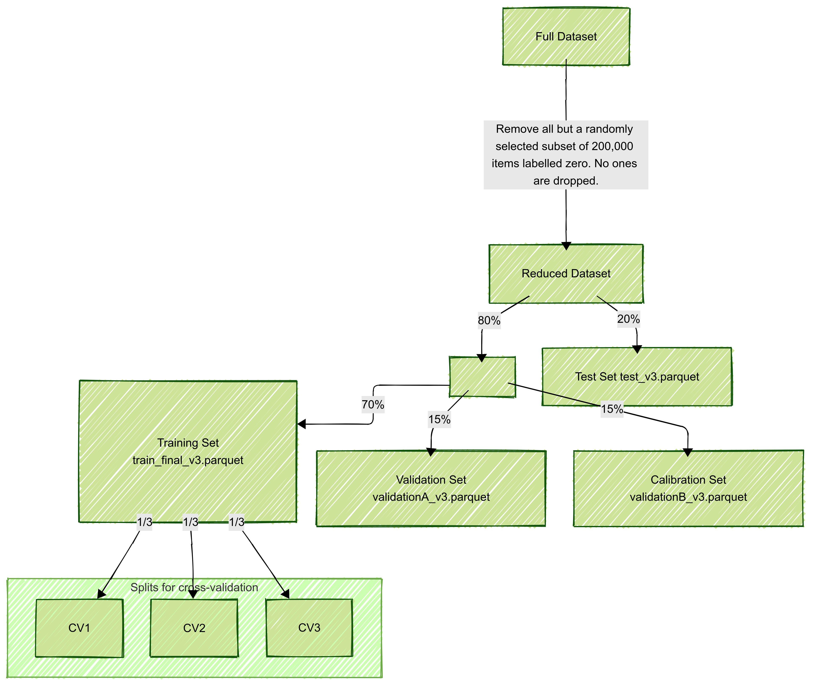

# Cleaning and Feature Engineering

This directory contains notebooks and scripts for cleaning Amazon product metadata and review data, engineering features, and builds the main datasets for modeling.

## Contents

- **meta_cleaning.ipynb**  
  Cleans and imputes missing values in Amazon product metadata, including product ranks and categories. Outputs a cleaned metadata file.

- **reviews_features.ipynb**  
  Processes raw Amazon review data to engineer product-level features such as average ratings, review counts, reviewer activity, and text statistics.

- **EmbeddingCalculationReviewText.ipynb**  
  Computes sentence embeddings for review texts using a pre-trained transformer model and saves them for semantic analysis.

- **SimilarityScore_ReviewEmbeddingAggregation.ipynb**  
  Calculates semantic similarity scores between reviews and reference complaint/shipping sentences, incorporates sentiment analysis, and aggregates features at the product level.

- **CleanReviewsData.ipynb**  
  Cleans review data by removing low-information and problematic reviews/products, and outputs a list of ASINs with high-quality review data.

- **combining_and_splitting.ipynb**  
  Merges all cleaned and engineered features, balances the dataset, and performs stratified group splits for training, validation, and testing, ensuring label and group integrity.

- **custom_ttsplit.py**  
  Python module for stratified group splitting.

- **Missing file to generate  `agg_summary_embeddings.pkl`** 

- **Missing files to generate `sentences_complaint.pkl`**

## Workflow

1. **Clean and Impute Metadata:**  
   Run `meta_cleaning.ipynb` to produce cleaned product metadata.

2. **Engineer Review Features:**  
   Run `reviews_features.ipynb` to generate product-level review features.

3. **Compute Review Embeddings:**  
   Run `EmbeddingCalculationReviewText.ipynb` to generate review text embeddings.

4. **Calculate Similarity and Sentiment Features:**  
   Run `SimilarityScore.ipynb` to compute semantic similarity and sentiment features for reviews.

5. **Clean Review Data:**  
   Run `CleanReviewsData.ipynb` to drop products with low-quality reviews.

6. **Combine and Split Data:**  
   Run `combining_and_splitting.ipynb` to merge all features and create balanced, stratified train/validation/test splits.

**Note:**  
Several of the above notebooks take a long time to run, and as currently written, require a CUDA-capable GPU. If one only wants to obtain the final dataset used in modelling, the necessary files can be downloaded by applying the `../Data/download_traintestdata.py` script, which downloads the files returned by the `combining_and_splitting.ipynb` script.

## Details
The cleaning and feature engineering process starts with raw Amazon product metadata and review data. The steps include:

### Metadata Cleaning (`meta_cleaning.ipynb`)
  
  Most columns in the amazon product metadata contain too many missing values to be useful. The two features we want to keep are the product rank and the product category.

  #### Categories
  The category field contains strings such as `Toys & Games > Preschool > Pre-Kindergarten Toys`. Here `Toys & Games` is the main category, `Preschool` is the first-level subcategory and `Pre-Kindergarten Toys` is the second-level subcategory. Since most items have first level categories that are equal to `Toys and Games`, we will assign the first-level subcategory to each product in the final dataset. Thus a product whose category is labelled `Toys & Games > Preschool > Pre-Kindergarten Toys` in the raw dataset, is given the category `Preschool` in the final dataset. 
  
  To fill in missing values in the category, we look at all products in the `also_buy` and `also_view` fields of each item, and take the most frequently occurring category that appears in these products. The remaining entries with no category are dropped.

  #### Rank
  Each item is given a ``rank'' in the raw dataset of the following form.
  ```
  ['>#2,230,717 in Toys & Games (See Top 100 in Toys & Games)', '>#57,419 in Toys & Games > Puzzles > Jigsaw Puzzles']
  ```
  For the above item, the second ranking of 57,419 is only comparable to other Jigsaw Puzzles. Therefore, we drop this secondary ranking, and assign such an item a ranking of 2,230,717, which is comparable to all items with such a ranking (the majority of the dataset).

  Unfortunately, there are cross-listed items which don't have a Toys & Games ranking. For example consider the following ranking in the raw data:
  ```
  ['>#262,028 in Office Products (See top 100)', '>#22,641 in Toys & Games > Learning & Education', '>#179,438 in Toys & Games > Preschool > Pre-Kindergarten Toys']
  ```
  In this situation, although there is no "Toys & Games" ranking, we can impute such a ranking as follows. We first note that there are 106438 items in the dataset that contain both a `Toys & Games` rank and a `Toys & Games > Preschool > Pre-Kindergarten Toys` rank. We can then predict the `Toys & Games` ranking for the above item,  using a KNearestNeighbours model.

  The remaining rank missing values can be imputed by taking the geometric mean of ranks of similar items that have a rank and appear in the `also_buy` or `also_view` fields. The remaining product with missing rank are now dropped. 

### Cleaning and engineering features on the review data (`reviews_features.ipynb`)
  - Reviews with missing `summary`,`reviewText` or `reviewerName` fields are dropped.
  - The `image`, `vote`, `style` and `reviewTime` column are dropped.
  - Reviews are grouped by ASIN and for all reviews of the same product, the following statistics are calculated:
    - The min and max rating.
    - The mean rating.
    - The number of ratings.
    - The percentage of verified reviewers.
    - The percentage of positive ($\geq$ 4 stars) and negative ($\leq 2$ stars).
    - The earliest and latest date of review, and the length of time between these reviews.
    - The average number of reviews per day.
    - The number of unique reviewers.
    - The average review length (both in words and in characters).
    - The number of suspected bots per product. This is calculated as follows. A reviewer is labelled as a suspected bot if all the following hold:
        - The reviewer has left at least 10 reviews.
        - The reviewer has an average of at least 3 reviews per day (between the first and last review posted).
        - The reviewer has reviewed at least 10 products.
        - The reviewer either has left all 5-star reviews, or at least 80% one-star reviews.

### Review Text Embedding (`EmbeddingCalculationReviewText.ipynb`)

The review text for each review is cleaned. The model `all-MiniLM-L6-v2` is applied to the cleaned review text to generate embeddings. 

### TODO: Reference vectors from complaints data

### Similarity and Sentiment Scoring (`SimilarityScore.ipynb`)
We compute the cosine similarity scores of the review text with the collection of text embeddings of the reference complaint sentences. 

To reduce false positives, we do the following.  We first use a sentiment classifier (`distilbert-base-uncased-finetuned-sst-2-english`) to compute sentiment scores for each review. Then we filter out reviews with high similarity to complaint sentences, but positive sentiment, in order to reduce false positives. We also compute similarity scores with a collection of negative sentences relating to shipping related issues.

We then aggregate mean and maximum similarity and sentiment scores per ASIN, and compute weighted and mean review embeddings per ASIN, giving more weight to negative reviews.

### TODO: Summary embeddings

### Review Data Cleaning (`CleanReviewsData.ipynb`)
 We drop reviews with missing data, and also drop products where the only review is a single word.

### Combining and splitting
  We combine the following data files into a single DataFrame:
  - The matches (from `../matches/MatchWithPretrainedModelandLLM.ipynb`)
  - The cleaned metadata (from `meta_cleaning.ipynb`)
  - The review metadata non-embedding features (from `reviews_features.ipynb`)
  - The aggregated review embeddings and their similarity score (from `SimilarityScore.ipynb`)
  - The aggregated summary embeddings.
  - The dropped products from review cleaning (from `CleanReviewsData.ipynb`)

  In order to prevent data leakage when performing splits, we add a `component_no` column to our DataFrame as follows. We consider the bipartite graph $\mathcal{G}$ such that:
  -  vertices of $\mathcal{G}$ consist of all Amazon products and incident reports/recalls
  - an Amazon product is connected by an edge to an incident report precisely when there is a match between them. 
  
  Each connected component in $\mathcal{G}$ is labelled with a distinct integer, and the component `component_no` records this integer for each Amazon product.

  We then choose a random sample of 200,000 products that are labelled zero (i.e. not matched to any incident report or recall) and drop all the other products labelled zero. This is because our dataset is both very large (over 600,000 rows) and very imbalanced. This is our final dataset.

  We now perform several different splittings of our dataset using the `StratifiedGroupSplit` function in `custom_ttsplit.py`. This function extends the standard train split function in that it aims to achieve all of the following: 
  - Preserve components -  all items in the DataFrame with the same `component_no` end up in the same dataset after the split.  
  This condition is important to avoid *data leakage*, which can occur when several similar amazon items are labelled 1 because they are matched to the same incident report.
  - Preserve the proportion of items labelled one (i.e. with a positive match) in each split as much as possible.   
  This condition is necessary because we want to ensure all our training, validation and test sets should have an equal proportion of matched items, in order to obtain accurate and unbiased models.

  - Preserve the ratio $$\frac{\text{number of components labelled 1 in a split}}{\text{size of split}}.$$   
  This condition is important because of the imbalance in the size of components. A bad split, might consist of a large number of products labelled 1, but a relatively low number of components. As products in the same component are similar to one another, such splittings will not yield a representative distribution of items labelled 1.

The custom function `StratifiedGroupSplit` seems to outperform the built-in sklearn ``StratifiedGroupKFold`` function in terms of a split satisfying all three of the above properties.

We perform the following splits, as illustrated in the diagram below.

- Split the above DataFrame into two, an 80% __training superset__, and a 20% __testing set__.
- In order to perform probability calibration and validation of our models, the training superset is split again as follows:
  - a __training set__ consisting of 70% of the training superset.
  - a __validation set__ consisting of 15% of the training superset.
  - a __calibration set__ consisting of 15%  of the training superset.
- The training set is split again into three equal sets, which will be used for __3-fold cross-validation__.

All these splittings are made preserve the components, the proportion of products labelled one, and the proportion of components labelled one, as much as possible.

The data in these splits is saved to the following files:
1. Training set - ``../Data/train_final_v3.parquet``
2. Validation set - ``../Data/validationA_v3.parquet``
3. Calibration set - ``../Data/validationB_v3.parquet``
4. Test set - ``../Data/test_v3.parquet``
5. 3-fold cross-validation (indices only) - ``../Data/CV_val_split.parquet``

